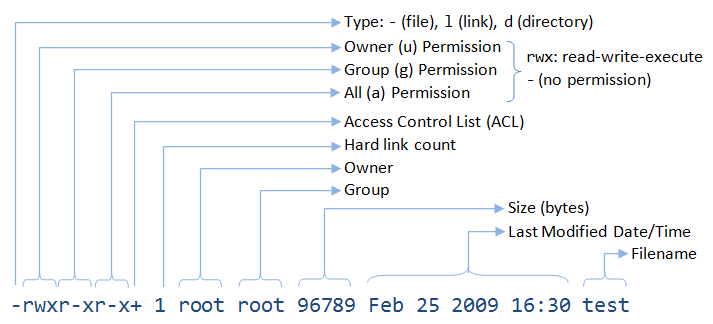
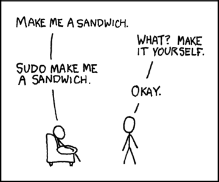

## (In the Beginning was) "The Command Line"


...and that was, and *remains*, how one can issue a series of commands, precisely and repeatedly, to a computer's __Operating System__

## The Operating System


## All about the *NIX


UNIX
 :  Originally developed at AT&T Bell Labs circa 1970. Has
     experienced a [long, multi-branched
     evolutionary path](https://upload.wikimedia.org/wikipedia/commons/7/77/Unix_history-simple.svg)

POSIX (Portable Operating System Interface)
 :  a set of specifications of what an OS needs to qualify as "a Unix", to enhance interoperability among all the "Unix" variants


## Various Unices


* OS X
 :  [is a Unix](http://unix.stackexchange.com/questions/1489/is-mac-os-x-unix)!
* Linux
 :  is _not_ fully POSIX-compliant, but certainly can be
      regarded as [functionally Unix](http://en.wikipedia.org/wiki/Unix-like)
      

## Some Unix hallmarks


* Supports multi-users, multi-processes
* Highly modular: many small tools that do one thing well, and can be combined
* Culture of text files and streams
* Primary OS on HPC (**High Performance Computing** Systems)
* Main OS on which Internet was built

## The Command Line


GUI
 :  Graphical user interface (on the right)
 
CLI
 :  Command-line interface (on the left)
 

 
## GUIs can be impressive


#### [Pay no attention to that man behind the curtain](http://www.youtube.com/watch?v=YWyCCJ6B2WE)

## ..but CLIs let you get things done as well, often more quickly and reproducibly


    
##The Command Line Interface (CLI) provides a direct way to interact with the Operating System, by typing in commands. 


## Why the CLI is worth learning

* Typically much more extensive access to features, commands, options
* Command statements can be written down, saved (scripts!)
* Easier automation
* Much "cheaper" to do work on a remote system (no need to
      transmit all the graphical stuff over the network)
      
## Logging In & Logging Out-- access to the CLI

*   ssh
*   terminal (OSX)
*   DOS prompt/"Command Shell" (MS Windows)
*   popular Shells: bash, zsh, csh, tcsh, ksh, sh
*   Shell startup files set the ENVIRONMENT: 

`env` to see your environment

		schild@treme:~$ env
		
		TERM_PROGRAM=Apple_Terminal
		SHELL=/bin/bash
		TERM=xterm-256color
		CLICOLOR=1
		TMPDIR=/var/folders/km/r7z_gyhj5417zkjwvzkbng180000gn/T/
		USER=schild
		PATH=/opt/local/bin:/opt/local/sbin:/Library/Frameworks/
		GDAL.framework/Programs:/Library/Frameworks/GEOS.framework:/usr/local/
		bin:/opt/local/bin:/usr/bin:/bin:/usr/sbin:/sbin:/opt/X11/bin:
		/usr/local/git/bin
		PWD=/Users/schild
		LANG=en_US.UTF-8
		HOME=/Users/schild
		LOGNAME=schild
		ARCHFLAGS=-arch x86_64

		schild@treme:~$ 

* to logout: `logout` or `exit`

### Navigating and managing files/directories in *NIX

* `pwd`, `ls`, `cd`
* `~`, `.`, `..`
* go to my "Home" directory:  `cd ~`
* go up one directory level: `cd ..`
* `mkdir`, `cp`, `mv`
* `rm`, `rmdir`


## Permissions



### All files have permissions and ownership


* Change permissions: `chmod`
* Change ownership: `chown`
* List files showing ownership and permissions: `ls -l`

			schild@aurora:~/postdoc-training/data$ ls -l
			total 1136
			-rw----r-- 1 schild scientist 1062050 May 29  2007 AT_85_to_89.csv
			-rwxrwxr-x 1 schild scientist   16200 Jun 26 11:20 env.csv
			-rwxr-xr-x 1 schild scientist   23358 Jun 26 11:20 locale.csv
			-rwxrwx--- 1 schild scientist    7543 Jun 26 11:20 refrens.csv
			-rwx------ 1 schild scientist   46653 Jun 26 11:20 sample.csv 		
* Clear contents in terminal window: `clear`

## Elevate your permissions



## Getting help

  

* `<command> -h`, `<command> --help`
* `man`, `info`, `apropos`, `whereis`
* Search the web!

## General command syntax

* `$ command [options] [arguments]`

### where `command` must be an _executable_ file on your `PATH`
* `echo $PATH`

### and `options` can usually take two forms
* short form: `-h`
* long form: `--help`

### some useful, special commands using the Control key
* Cancel (abort) a command: `Ctrl-c`
* Stop (suspend) a command: `Ctrl-z`
* `Ctrl-z` can be used to suspend, then background a process

### History
* See your command history:  `history`
* Re-run last command:  `!!`  (pronounced "bang-bang")
* Re-run 32th command: `!32`
* Re-run 5th from last command: `!-5`
* Re-run last command that started with 'c': `!c`


## Unix systems are multi-user
* Who else is logged into this machine?  `who`
* Who is logged into "this shell"?  `whoami`

## What about "space"
* How much storage is available on this system?  `df -h`
* How much storage am "I" using overall?  `du -hs`
* How much storage am "I" using, by subdirectory?  `du -h`

<!--
```bash
$ sudo vi /etc/postgresql/9.1/main/postgresql.conf
```
-->

## Text editing

### (Text rules!)

### Some editors

* `vim`
* `emacs`
* `nano`

### `$ nano .bashrc`

## Let's look at our text file

* `cat` print file(s)
* `head` print first few lines of file(s)
* `tail` print last few lines of file(s)
* `less` "pager" -- view file interactively (type `q` to quit command)qqqbf
*   `od --t` "octal dump" -- to view file's underlying binary/octal/hexadecimal/ASCII format

   
```bash
$ schild@aurora:~/data$ head -3 env.csv
EnvID,LocID,MinDate,MaxDate,AnnPPT,MAT,MaxAT,MinAT,WeatherS,Comments
1,*Loc ID,-888,-888,-888,-888,-888,-888,-888,-888
1,10101,-888,-888,-888,-888,-888,-888,-888,-888

$ schild@aurora:~/data$ head -3 env.csv | od -cx
0000000   E   n   v   I   D   ,   L   o   c   I   D   ,   M   i   n   D
           6e45    4976    2c44    6f4c    4963    2c44    694d    446e
0000020   a   t   e   ,   M   a   x   D   a   t   e   ,   A   n   n   P
           7461    2c65    614d    4478    7461    2c65    6e41    506e
0000040   P   T   ,   M   A   T   ,   M   a   x   A   T   ,   M   i   n
           5450    4d2c    5441    4d2c    7861    5441    4d2c    6e69
0000060   A   T   ,   W   e   a   t   h   e   r   S   ,   C   o   m   m
           5441    572c    6165    6874    7265    2c53    6f43    6d6d
0000100   e   n   t   s  \r  \n   1   ,   *   L   o   c       I   D   ,
           6e65    7374    0a0d    2c31    4c2a    636f    4920    2c44
0000120   -   8   8   8   ,   -   8   8   8   ,   -   8   8   8   ,   -
           382d    3838    2d2c    3838    2c38    382d    3838    2d2c
0000140   8   8   8   ,   -   8   8   8   ,   -   8   8   8   ,   -   8
           3838    2c38    382d    3838    2d2c    3838    2c38    382d
0000160   8   8   ,   -   8   8   8  \r  \n   1   ,   1   0   1   0   1
           3838    2d2c    3838    0d38    310a    312c    3130    3130
0000200   ,   -   8   8   8   ,   -   8   8   8   ,   -   8   8   8   ,
           2d2c    3838    2c38    382d    3838    2d2c    3838    2c38
0000220   -   8   8   8   ,   -   8   8   8   ,   -   8   8   8   ,   -
           382d    3838    2d2c    3838    2c38    382d    3838    2d2c
0000240   8   8   8   ,   -   8   8   8  \r  \n
           3838    2c38    382d    3838    0a0d
```
   
 * `od` is especially useful in searching for **hidden characters** in your data
 * watch for **carriage return** `\r` and **new line** `\n\` 
 * `dos2unix` and `unix2dos` 

## A sampling of simple commands for dealing with files

* `wc` count lines, words, and/or characters
* `diff` compare two files for differences
* `sort` sort lines in a file
* `uniq` report or filter out repeated lines in a file
 

## Get into the flow, with pipes 


```bash
$ ls *.jpg | wc -l
$ ls *.jpg | wc -l > jpegcount.txt
$ diff <(sort file1.txt) <(sort file2.txt)
$ ls foo 2>/dev/null
```
* note use of `*` as character wildcard for zero or more matches (same in Mac and Windows); `%` is equivalent wildcard match in SQL queries
* `?` matches single character; `_` is SQL query equivalent

## Create custom commands with "alias"
alias lwc='ls *.jpg | wc -l'

You can create a number of custom aliases that are available whenever you login, by putting commands such as the above in your shell start-up file, e.g. `.bashrc`


## A sampling of more advanced utilities

* `grep` search files for text
* `sed` filter and transform text
* `find` advanced search for files/directories

## grep


## grep

### Show all lines containing "bug" in my R scripts

```bash
$ grep bug *.R
```

### Now count the number of occurrences per file

```bash
$ grep -c bug *.R
```

### Print the names of files that contain bug

```bash
$ grep -l bug *.R
```

### Print the lines of files that __don't__ contain bug

```bash
$ grep -v bug *.R
```

### Print "hidden" dot-files in current directory
```
$ ls -a | grep '^\.'   
```
## sed


## sed

### Remove all lines containing "bug"!

```bash
$ sed '/bug/d' myscript.R
```

### Call them buglets, not bugs!

```bash
$ sed 's/bug/buglet/g' myscript.R
```

### Actually, only do this on lines starting with #

```bash
$ sed '/#/ s/bug/buglet/g' myscript.R
```


## find


### Like Rover, the Windows search dog. But more useful.

## find

### Show me my pdfs!

```bash
$ find . -iname '*.pdf'
```

### Which files are larger than 10GB?

```bash
$ find . -size +10G -ls
```

## Getting things done

* Process management
    * Like Windows Task Manager, OSX Activity Monitor
    * `top`, `ps`, `jobs`
    * `kill` to delete an unwanted job or process
* Foreground and background
* Stay persistent with `Byobu`: to keep your session live even if you disconnect, type this once logged in the server:  ```byobu-enable```
* Need to go visual?
    * x2go, X11 forwarding, VNC
    
---
## Above are just a few of the most useful Linux & Unix commands based on our experience.  
###There are many more, and they comprise a ***rich*** set, that will serve you for years. They can be used in combination, and run from scripts.  They can empower you when using high-end analytical servers, or doing repetitive tasks!    

## Online resources

* http://linuxcommand.org/
* http://www.linfo.org/command_line_lesson_1.html
* [Free book!](http://linuxcommand.org/tlcl.php):  http://linuxcommand.org/tlcl.php
* More about byobu: https://help.ubuntu.com/community/Byobu
