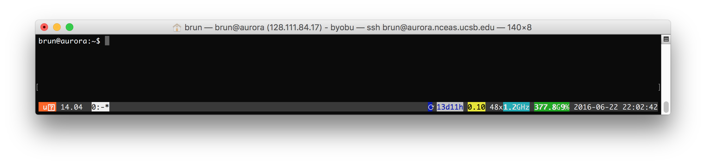

# Secure Shell (ssh)

* Used for connecting to and running shell commands on a remote host
* Tremendously simplifies remote computing
* Supported out-of-the-box on Linux and Macs

##	 Let us connect to Aurora:

From the gitbash or the terminal type

```bash
ssh aurora.nceas.ucsb.edu
```
You will be prompted for your username and password.



You can also use:
```bash
ssh brun@aurora.nceas.ucsb.edu
```
In this case, you will be only ask fro your password as you already specified which user you want to connect with.


## Lay of the land


![]
Let's create a directory `snapp-workshop`, go into this folder and download the Rscript from here: `https://www.nceas.ucsb.edu/~brun/10min-loop.R`

```bash
mkdir snapp-workshop
cd snapp-workshop
wget https://www.nceas.ucsb.edu/~brun/10min-loop.R
```

## Runnig a R script from the command line

Has the file name was suggesting, this script takes 10min to count to 100. Let's try to run it:

```bash
Rscript 10min-loop.R
```

**Close your window and try to reconnect. What happened?**

## Byobu

Use Byobu to keep your session live even if you disconnect, type this once logged in the server:  `byobu-enable`

and this is it!

Byobu is called a multiplexer and offers a lot of useful functionalities to work through remote shell, such as multiple tabs, split windows, ...

https://help.ubuntu.com/community/Byobu 

## Running the R console
```bash
R
```
You are in!


## References

* Running a R Script: https://support.rstudio.com/hc/en-us/articles/218012917-How-to-run-R-scripts-from-the-command-line
* Boybu: http://byobu.co/