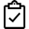

In addition to the connection via ssh we used, there are alternative ways to connect to Aurora and in general a remote server. Here we will discuss two alternative ways that offer a grapical user interface (GUI). 

## Alternative ways to connect to a remote server (Aurora)
* **X2Go** : *remote desktop*
* **RStudio server** : connect to *RStudio IDE* from your web browser

## X2Go Remote Desktop

First you will need to install the client on your machine:

http://wiki.x2go.org/doku.php

Then we will need to setup your connection for Aurora:

https://help.nceas.ucsb.edu/remote_access_using_x2go


  **Put your nametag up once you are connected succesfully!**

 Let's find the training folder (in Unix it is referred as a *directory*) you downloaded and *create* a *subdirectory* named ```remote-desktop``` in the 02-working-remote dire

 Avoid using spaces in your file and directory names, it will make it more complicated to use in a command line environment. Simply subsitute them by ``` - ``` or ``` _ ``` .


### Advantages
* You get a desktop like environment with Graphical User Interface (GUI)
* Low learning curve to use it
###Disadvantages
* Can be slow due to the need of transfering more data over the network for data for the Graphical Interface
* Some keyboard mapping issues with X2go ([see NCEAS wiki](https://help.nceas.ucsb.edu/remote_access_using_x2go))
*  Some issues with very high resolution MS Windows machines

## How to transfer files from / to a remote server

### Remote file access

You can transfer files between your computer and a server using optimized protocols (e.g. **sFTP** and **SCP**) via the command line or a software (GUI: cyberDuck, WinSCP, ...). See this [page](https://help.nceas.ucsb.edu/remote_file_access?s[]=winscp) on NCEAS wiki help about software examples


### **SAMBA** file sharing

Using SAMBA shares, you can mount/attach your home directory on the server (or a specific folder) to your computer as a remote drive. Here is a [page](https://help.nceas.ucsb.edu/mount_your_home_directory) on NCEAS wiki help to help you to do so.

**Notes**:

- To use SAMBA remotely with NCEAS server, *you need to have VPN access to the UCSB domain*
- You write the files directly to the server:
 - new files will automatically overwrite previous version
 - it can become slow for large files

