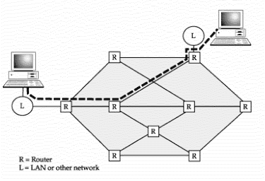

## Working Remote Overview
The goal of this session is to get familiar with some concepts of Internet and how computer use it to talk to each other. Then we will look into different ways you can connect to a remote server. We will follow by an introduction to the command line that you will exercice to create folder and files.


## Why should I bother? I like my PC!!!
Few advantages of working remote:

* **Power**: More *CPUs/Cores* (48), More RAM (384GB) 
* **Capacity**: More *disk space* and generally* faster storage* (array)
* **Security**: Data spread accross *multiple drives* and nightly *backup*
* **Collaboration**: *shared folder*, same *software version*

### NCEAS analytical server _Aurora_

 - **48 logical cores** (vCPUs) / 24 physical cores with hyperthreading
 - **3.5 GHz Turbo** / 2.6 GHz minimum
 - **384 GB** 2133 MHz ECC DDR4 memory
 - **20 TB fast storage** array with 1TB SSD write cache on local storage
 - **Nightly Backup**

=> For more info about Aurora: [https://help.nceas.ucsb.edu/high\_performance\_computing](https://help.nceas.ucsb.edu/high_performance_computing)


## The Internet


## Our goal is to:

* Provide basic background on computer networking 
* Lay groundwork for understanding tools that use the Internet

## Basic networking

* Host computers connect via networking equipment
* Can send messages to each other over communication protocols
* Client: the host *initiating* the request
* Server: the host *responding* to a request


## Local networks


- All messages broadcast on the local network
    - Local hosts only "listen" for data that targets them

## Routed networks



* Mechanism to connect networks together via forwarding data along routing paths


## IP Numbers and Hostnames

* Hosts are assigned a unique IP number used for all communication and routing
    - 128.111.220.7
* Each IP Address can be used to communicate over various "ports"
    - Allows multiple applications to communicate with a host without mixing up traffic

* IP numbers can be difficult to remember, so also assign hostnames
    - Handled through the global Domain Name System (DNS)
    - Clients first look up a hostname in DNS to find the IP Number
    - isis.nceas.ucsb.edu -> 128.111.220.46
    - Then they open a connection to the IP Number


## Client-Server and the Internet


## Peer to Peer networking


## Internet versus the Web

### What is the difference?

* Internet: Global communication network using the Internet Protocol (IP)
    - Supports many application protocols, including HTTP

* Web: Global system of interlinked hypertext documents
    - Transported over HTTP application protocol (over IP)
    - Generally accessed using web browsers that retrieve the documents

## Routing on the internet

* 80 routers at the core
* dense "mantle" of routers at the periphery
    - loss of the core still leaves > 70% of internet connected peer-to-peer


## Internet Application Protocols

* Web (http)
* Email (smtp)
* Secure Shell (ssh)
* Telnet (telnet)
* File Transfer Protocol (ftp)
* Network News (nntp)
* ...

## The Web

* Global network of documents hosted on web servers around the world
* Web documents connected using hyperlinked HTML documents
* Other document types common (images, other media)


## Secure Shell (ssh)

* Used for connecting to and running shell commands on a remote host
* Tremendously simplifies remote computing
* Supported out-of-the-box on Linux and Macs

### We will use this later:

```bash
ssh aurora.nceas.ucsb.edu
```

## References


## Sources
This material has been adapted from the [Open Science for Synthesis - 2014](https://www.nceas.ucsb.edu/OSS) training material. See [NCEAS github repository](https://github.com/NCEAS/training/tree/master/2014-oss) for more information.
