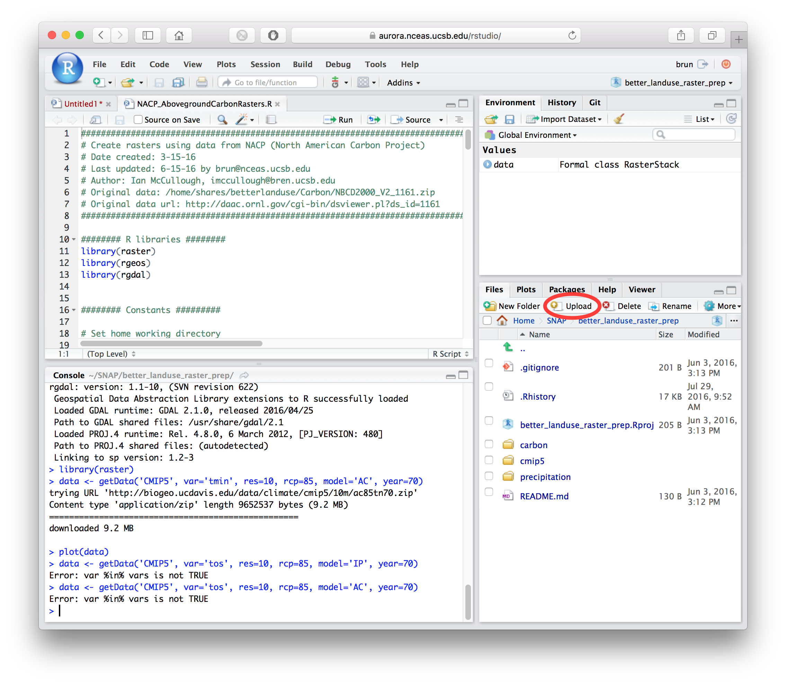
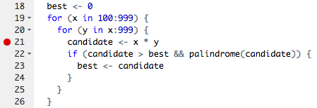
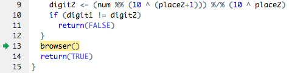
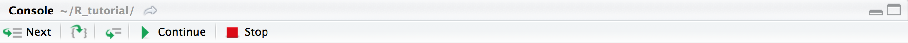

# Getting familiar with RStudio

***RStudio is a free and open source Integrated Development Environment (IDE) that makes developing R scripts easier.*** 

In addition to the R console, this software provides: a script editor, a visual capture of your commands history, the contents of your environment, plots history, file browser, interactive debugger, and more. With RStudio, you can also manage code versioning and publish documents.

Download RStudio here: [https://www.rstudio.com/products/rstudio/download3/](https://www.rstudio.com/products/rstudio/download3/)

We recommend that you install RStudio Desktop (free license) on your personal computer. RStudio server can also be installed on a server to allow access to the RStudio IDE via your web browser (See the RStudio Server Section below for more information).

## Navigating inside RStudio

**The RStudio environment consists of four main panels:**
*Code, Console, Workspace* and *Plotting area*

(image source: <https://www.rstudio.com>)

The **Code Panel** is where you can view, edit and execute/source R scripts. Technically, any piece of code run in the code panel is no different than entering the code into the console, but the code panel makes it easier to view and edit code by providing syntax highlighting and indentation to help you to organize your script. You can also execute code line by line in a reproducible manner. To run chunks of code in the code panel, highlight lines and click the "Run" button (upper-right of code panel) or press `Ctrl` or `Command` on a Mac and `Enter`. You can easily copy and paste text from other places in the code panel, or copy and paste into the console. Finally you can execute the entire script by clicking on the "Source" button.

The **Console** is where you can type code manually, or paste code from the code panel or other programs. If you have used R without RStudio previously, this console is basically the same as the classic R console. Running more than a few lines of code in the console can be clunky, especially when you need to troubleshoot errors, so we recommend using the console for 1) testing small pieces of code or basic functions, 2) inspecting the output of your code, 3) viewing error messages.

*Note:* your current working directory is displayed at the top of the console. You can manually set a working directory at any time, but the default directory is used when a new session is started. The default can be changed under *Tools -> Global Options -> General*.

The **Workspace Panel** by default displays your R global environment, which contains the names of the variables and datasets your code defines (e.g., data frames, matrices, strings, etc.). Some datasets can be viewed by double-clicking the name in the environment. The "History" tab shows what code has been previously run in your session. The same history can be viewed in less abbreviated form (errors and printed output included) by scrolling through the console. You can select lines from the History and use the "To Console" or "To Source" to send automatically the selected commands to the R Console or to your R Script (where the cursor is located), respectively.

Despite its name, the **Plotting Area Panel** contains several important tabs. One of which is "Plots" that displays visual results of R code (e.g., graphs, maps) and allows you to browse your plots history. Note the "Zoom" and "Export" buttons for exploring and saving your visualizations. The "Files" tab displays your directory structure (based on your default or defined working directory). The "Packages" tab contains all the loaded (checked) and installed but not loaded for your current session (listed, but unchecked) R packages in your System Library. You can install a Package by clicking on the "Install" button. Clicking a package name brings up its documentation in the "Help" tab. You can manually navigate or search for documentation in the "Help" tab, but also note that typing `?function_name` in the console (e.g., `?cbind`) locates documentation for a particular function in the "Help" tab. Functions from uninstalled packages cannot be found in the "Help" tab until respective packages are installed. The ["Viewer" tab](https://support.rstudio.com/hc/en-us/articles/202133558-Extending-RStudio-with-the-Viewer-Pane) is for local web content, often from specific packages.

Note that the organization and size of the various panels, as well as the contained tabs, can be customized by the user.

## RStudio Projects

*This section is adapted from the more detailed material available on the RStudio website: <https://support.rstudio.com/hc/en-us/articles/200526207-Using-Projects>*

RStudio Projects enable you to organize your work by setting a directory on your machine as the main directory. Note that by default, this directory will be set as the working directoy. To create a new project you can use the menu *File -> New Project* or the drop-down menu from the top right corner of the RStudio IDE. From the top right corner you can also see the recently opened projects. When you create a RStudio Project, a file with the extension `.Rproj` will be created in the main directory. Once you are working within a project this same top right area will display the name of the project you are currently working on. By default, a Project will save the current status of your session: workspace (including data loaded), history and opened scripts. When you reopen a project, all of these configurations will be loaded for you, bringing your session back to the exact state you left it. 

**Note that to use code versioning through the RStudio IDE, you need to create a RStudio project.** However, we do not recommend you track the `.Rproj`, `.RData` and `.Rhistory` and other .R* files present in the main directory. See the Section on code versioning below for more information.

## RStudio Server

RStudio server is simply RStudio running on a remote machine that you access via your web browser. For example, **RStudio server is running on the NCEAS analytical server Aurora.** You can connect here:  <https://aurora.nceas.ucsb.edu/rstudio>. If you do not have an account on this server, please coordinate with your Working Group leaders to obtain one.

Notes there are 2 main differences:

1. With RStudio Server you are running your job on a remote machine, possibly leveraging the large amount of RAM and CPUs available on that host compared to your desktop/laptop. Also, when you close your browser window, you do not stop the process/script running! It can be very useful to disconnect and reconnect later, as script execution continues and your code and history is just like you left it.
2. You will need to move your files and scripts to the remote machine in order to access them. Note the extra upload button on the files tab of the plotting area (circled in red in Figure below) that allows you to transfer one file at a time. If you have several files to transfer, you can either create a zip file or use another tool (sftp, scp, ...) to upload your data to the server.

## Debugging in RStudio

*This section is adapted from the more detailed material available on the RStudio website: <https://support.rstudio.com/hc/en-us/articles/205612627-Debugging-with-RStudio>* 

Debugging is a broad topic that can be approached in many ways. Generically, at some point you will likely attempt to execute a script in R, receive errors and not know exactly what caused the errors. One approach would be to run your code line by line, but RStudio has some useful [built-in debugging features](https://support.rstudio.com/hc/en-us/articles/205612627-Debugging-with-RStudio). An in-depth webinar [can be found here](https://www.rstudio.com/resources/webinars/rstudio-essentials-webinar-series-programming-part-2/).

*One basic approach* to debugging is to create a breakpoint in your code -- this forces your code to "stop" executing when it reaches some certain function or line number in your code, allowing you then to examine the state of various variables, etc. The easiest way to do this is to set the breakpoint by manually clicking next to the desired line number in the code panel, [per this web example](https://support.rstudio.com/hc/en-us/articles/205612627-Debugging-with-RStudio):

(image source: <https://support.rstudio.com/hc/en-us/articles/205612627-Debugging-with-RStudio#stopping-on-a-line>)

Setting this **editor breakpoint** creates tracing code associated with the R function object. You can remove the breakpoint by clicking on the red dot by the line number. Also note the Debug toolbar has an option to clear all breakpoints.

*Note*: keep in mind that you can't set breakpoints anywhere. In general, you want to insert breakpoints at [top-level expressions or simple, named functions.](https://support.rstudio.com/hc/en-us/articles/200534337-Breakpoint-Troubleshooting)

An alternative way to set breakpoints is with the `browser()` function. This must be typed into your code, [per this web example](https://support.rstudio.com/hc/en-us/articles/205612627-Debugging-with-RStudio):

(image source: <https://support.rstudio.com/hc/en-us/articles/205612627-Debugging-with-RStudio#stopping-on-a-line>)

### The debugging interface

Once your code hits a breakpoint, RStudio enters debugging mode. Details on the debugging interface [can be found here](https://support.rstudio.com/hc/en-us/articles/205612627-Debugging-with-RStudio), but we summarize the main points below:

The **Environment** tab will display the objects in the environment of the currently executing function (i.e., the function's defined arguments)

The **Traceback** literally traces back how you arrived at the currently executing function (latest executed command is at the top of the list). This is analagous to the "call stack" in other programming languages.

The **Code window** highlights the currently executing function and may create a new tab, named *Source Viewer*, when the current function the debugger is stepping through is not in the main R script.

The **Console** retains most of its normal functionality in debugging mode, but contains some additional buttons that appear at the top to facilitate moving through code lines (see below).

