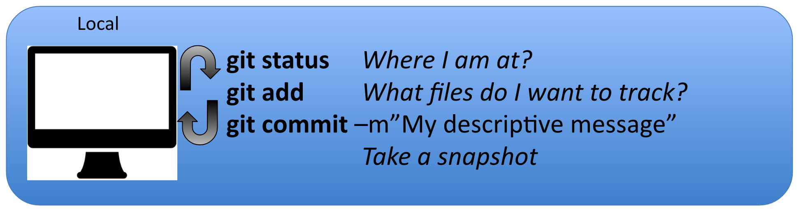

# Code versioning - Git Basics


## Why do I need that again?

Well let's start with a great example:

 


So git is very useful to **keep track of changes you made to your scripts**. Code versioning allows you to choose when you have reached a stage in your code that you think is worth keeping track of, like a new function that makes your data analysis soooooo much better. For scientists, git is a useful tool to help you to track changes you make to your scripts and enable you to share your codes with your collaborators. For example, if you break your code, git can help you to revert to an earlier working version. Want one of your collaborators to add a feature to your code to do a specific analysis? Git can help you to do so in a smooth and organized manner.


## What is git?


Git is a *free* and *open source* distributed *version control system*. It has many functionalities and was originally geared towards software development and production environment. In fact, Git was initially designed and developed in 2005 by Linux kernel developers (including Linus Torvalds) for Linux kernel development. Here is a [fun video](https://www.youtube.com/watch?v=4XpnKHJAok8) of Linus Torvalds touting git to Google. Git can be enabled on a specific folder on your filesystem to version files (including sub-directories) within that directory. In git (and other version control systems) terms, this “tracked folder” is called a repository (which formally is a specific data structure storing versioning information).

### More details:
  
- Git stores snapshot of your files (that have changes) 
- Git is distributed, meaning that all the copies of your repository are of equal value, containing all your codes and its history. There is no central repository
- Git has integrity, meaning each file is checked (summed) to be sure there was no bit loss during any file manipulation by git. Each snapshot (also called commit) has a unique identifier.

## What git is not
- Git is not a backup per se
- Git is not GitHub (or more accuralty the opposit way: GitHub is not Git)
- it is not good at storing large data (by default)


## The Git workflow

### Overview


1. You modify files in your working directory and save them as usual

2. You **add** snapshots of your changes files to your staging area.

3. You do a **commit**, which takes the files as they are in the staging area and stores them as snapshots permanently to your Git directory.

**And repeat!!**

Everytime you create a new snapshot, you add the new version of the file to the database, but all the previous versions are kept in the database. It creates what is like a graph that you can navigate:


## Getting started with Git

### [TRY GIT in 15min!](https://try.github.io/levels/1/challenges/1)

Before starting using git on any computer, you will have to set your identity as every snapshot of files is associated with the user who implemented the modifications to the files.

### 1. Setting up your identity
**Setup your profile:**

Your name and email: 

```
git config --global user.name “yourName”
git config --global user.email “yourEmail”
```

**Optional:**

Check that everything is correct: 

```
git config --global
```

Modify everything at the same time:

```
git config --global --edit
```

Set your text editor: 

```
git config --system core.editor vim
```

Want to know more? [here](https://git-scm.com/book/en/v2/Getting-Started-First-Time-Git-Setup) 

### 2. Starting a git repository

A **git repository** is a folder on your machine in which content is monitored for any changes by git.

```git init``` is the command to start the tracking in a specific directory and transform it into a git repository:

```
cd
mkdir git_nceas
cd git_nceas
mkdir snapp_workshop
git init
```

```git clone``` to copy an existing repository to your machine, more precisely adding the repository in the directory you are in.

```
cd 
mkdir git_nceas
cd git_nceas
git clone https://github.nceas.ucsb.edu/Training/postdoc-training.git
```

## Tracking your changes

Let us have a closer look at the git workflow. It is important that a good portion of the workflow happens on your local machine (in blue), whereas a part requires interactions with a remote machine (in purple):




## Getting information

* ```git status``` this command is your friend! It will tell you where you are at and what are your options. You can use at any point in your process.
* ```git log``` displays history of committed snapshots. It lets you list the project history, filter it, and search for specific changes.
* ```git diff --cached```
To be used before committing to preview the changes to be committed. 

Git has a lot of terms and commands, see reference at the end of this document for an extensive terminology. Here

## Undoing things

### Unstage a file

```git reset HEAD``` lets you remove a file from the staging area

```
git reset HEAD <my_file_I_added_by_mistake.xls>
``` 
This will remove the file from your next commit. Can be used to undo an erronous ```git add```.

### Undo your last commit

```git commit --amend``` let you change your last commit, like for example if you forgot a file

```
git add <missing_script.R>
git commit --amend -m "My new message"
```

More info about how to undo things [here](https://git-scm.com/book/en/v2/Git-Basics-Undoing-Things)

## Few terms you might have heared about git

* **HEAD**: it is the reference that points to the latest commit
* **Branches**: A branch represents an independent line of development, parallel to the master. In fact, the default branch name that is create by ```git init``` is ***master***.


## References
- Interactive git 101: https://try.github.io/ 
- Very good tutorial about git: https://www.atlassian.com/git/tutorials/what-is-version-control
- Git tutorial geared towards scientits: http://nyuccl.org/pages/gittutorial/
- Short intro to git basics: https://github.com/mbjones/gitbasics
- Git documentation about the basics: http://gitref.org/basic/
- Git documentation - the basics: https://git-scm.com/book/en/v2/Getting-Started-Git-Basics
- Git terminology: https://www.atlassian.com/git/glossary/terminology
- NCEAS wiki page on git: https://help.nceas.ucsb.edu/git?s[]=git
