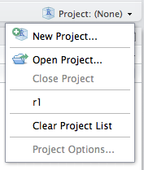
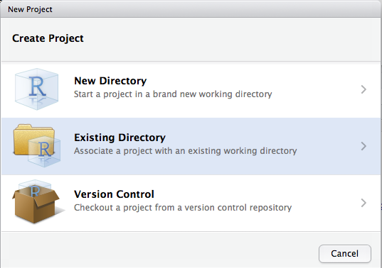
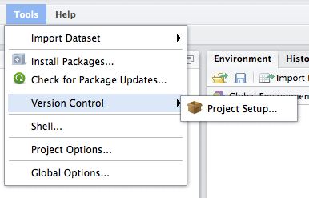
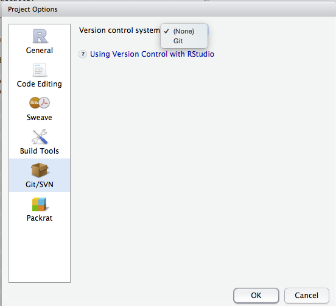
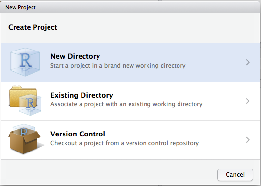
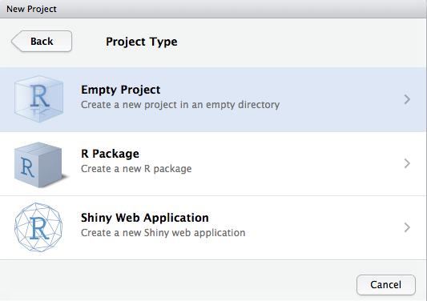
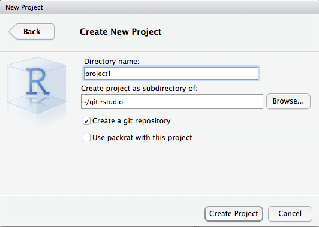
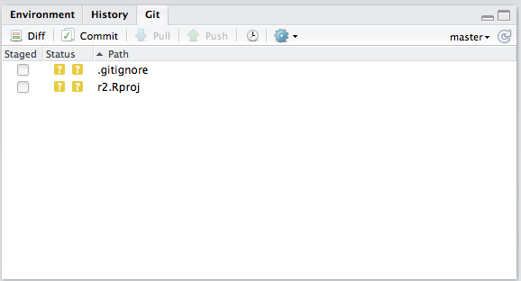
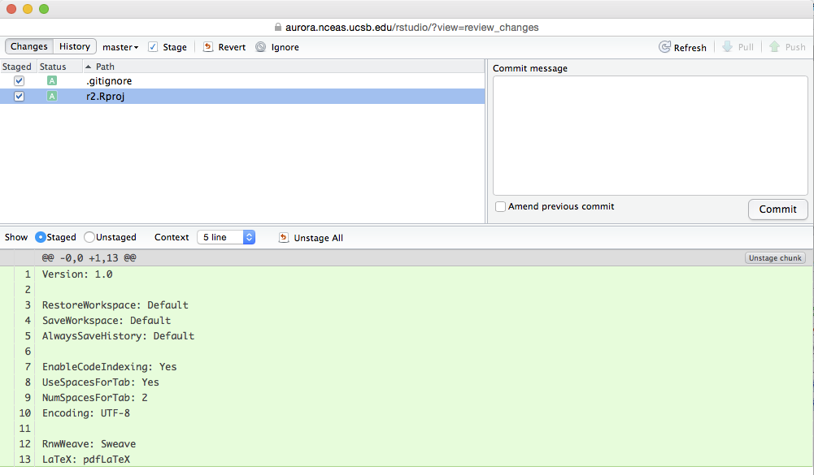

## Enabling git Version Control through RStudio 

*Note:* This is assumed that you already have use git on this computer/server. If not, you need to first [setup your identity](https://git-scm.com/book/en/v2/Getting-Started-First-Time-Git-Setup).

**If you want to use RStudio interface to control git, you need to create a Rstudio Project**. To do so, you need first to organize your files in one folder, that will become your git repository. Once this is done, you can create a new Rstudio Project from the upper-right corner of the RStudio IDE window, choosing *New Project* :

Now, you could have two situations:

* *Create the Project based on an existing folder* (e.g. you already have being working and writing code and you want to start using git versioning on this work)

* *Create the Project from scratch** based on a new empty folder

# Versioning existing work

### Create the RStudio Project

* Choose *Existing Directory* from the wizard

* *Browse* to the main folder containing your data

* *Create Project*

### Starting git version control 

Now you that have successfully created an RStudio project, you can enable the code versioning. Got to the *Tools* menu -> *Version Control *-> *Project Setup… *

This will open a new window. Change the *None* setting by choosing *Git* from the dropdown menu

Click *OK*. Answer *Yes* to the 2 following pop-ups to restart RStudio and enable git on your project.

# Versioning new work

* Create a new Rstudio Project from the upper-right corner of the RStudio IDE window, choosing *New Project* 

* Choose *New Directory* 

Note: The Version control option at the bottom is only to be chosen when you want to clone an existing repository.

* Choose *Empty* *Project*

* Give your project (folder) a *name*, *Browse* for its location on your drive. Finally, check the option *Create a git repository *before clicking *Create Project*.*
*

Congratulations, you have a new project with git versioning enabled!!

# Using git from RStudio

Now that you have enabled git versioning for your Project, a *Git* tab should have been added to your interface next to *Environment* and *History *tabs

Note that the *.gitignore *file is automatically generated by RStudio. It lists all file formats we do not want to track, here specifically the temporary files from R and Rstudio. You can edit this document to add any type of file you would like not git to track.

### Staging

To which files you want to track (aka staging), you need to check the boxes in front of the file names

### Committing

Then you can do your first commit -taking a snapshot of the current status of your work for the files you have decided to track (stage)-  by clicking on the *Commit* button (above your file names)

A new window should pop-up. Note that certain web browsers will block this pop-up.

You need to write a descriptive message of the work accomplished from the last commit in the Commit message window, then you can click the Commit button (below the Commit message window).

Then you can hit the button *Close* and close the commit window as you would close any system windows.

All the committed files should have disappeared from the *Git* tab on the RStudio IDE. A file will reappear when you save new changes. 

And you can start the whole commit process again, once you have reached a milestone in your work!! Commit frequently!!

We will talk about pushing and pulling to a remote machine/server another time.

