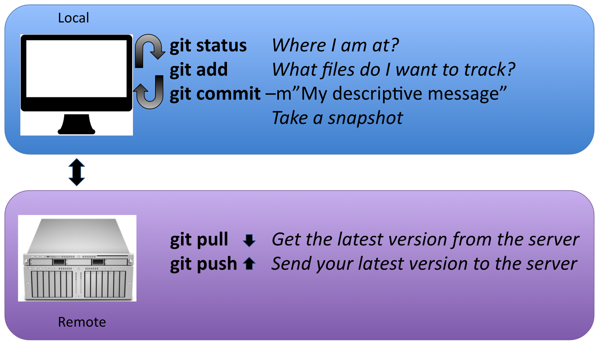

# Code versioning - Git


## Why do I need that again?

Well le's start with a greate [user case](http://www.phdcomics.com/comics/archive.php?comicid=1531) for motivation.


To **keep track of changes you made to your scripts**. Code versiong allows to choose when you reached a stage in your code that you think is worth keep trace of, like a new function that makes your data analysis soooooo much better. 
For scientists, git is a useful tool to help you to track changes you make to your scripts and enable you to share your codes with your collaborators. For example, if you break your code git can help you to revert to an earlier working version. Want one of your collaborators to add a feature to your code to do a specific analysis? Git can help you to do so in a smooth and organized manner.


## What git is
Git is a *free* and *open source* distributed *version control system*. It has many functionalities and was originally geared towards software development and production environment. In fact, Git was initially designed and developed in 2005 by Linux kernel developers (including Linus Torvalds) for Linux kernel development. Here is a [fun video](https://www.youtube.com/watch?v=4XpnKHJAok8) of Linus Torvalds touting git to Google. Git can be enabled on a specific folder on your filesystem to version files (including sub-directories) within that directory. In git (and other versions control systems) terms, this “tracked folder” is called repository (which formally is a specific data structure storing versioning information).

More details:
  
- Git stores snapshot of your files (that have changes) 
- Git is distributed, meaning that all the copies of your repository are of equal value, containing all your codes and its history. There no central repository
- Git has integrity, meaning each file is check(summed) to be sure there was no bit loss during any file manipulation by git. Each snapshot (also called commit) has a unique identifier.

## What git is not
- Git is not a backup perse
- Git is not GitHub (or more accuralty the opposit way: GitHub is not Git)
- it is not good at storing large data (by default)


## The Git workflow

### Overview


1. You modify files in your working directory and save them as usual

2. You **add** snapshots of your changes files to your staging area.

3. You do a **commit**, which takes the files as they are in the staging area and stores that snapshots permanently to your Git directory.


And repeat!!

You can do a parallel with taking a family picture: 

1. Everybody puts its latest outfit on
2. You select the persons you would like to add to the picture and  place them on your stage/scene and take the picture
3. You store your latest picture in your photobook 


## Few terms you might hear about git

* **HEAD**: it is the refence that points to the latest commit
* **Branches**: A branch represents an independent line of development, parallel to the master. In fact, the default branch name that is create by ```git init``` is ***master***.


## Git from the command line

### 1. Setting up your identity
**Setup your profile:**

Your name: ```git config --global user.name “yourName”```

Your e-mail: ```git config --global user.email “yourEmail”```

**Optional:**

Check that everything is correct: ```git config --global```

Modify everything at the same time ```git config --global --edit```

Set your text editor: ```git config --system core.editor vim```

Want to know more? [here](https://git-scm.com/book/en/v2/Getting-Started-First-Time-Git-Setup) 

### 2. Getting or starting a git repository

A **git repository** is a folder on your machine which content is monitored for any changes by git.

```git init``` to start the tracking in a specific directory and transform it into a git repository:

```
cd
mkdir git_nceas
cd git_nceas
mkdir snapp_workshop
git init
```

```git clone``` to copy an existing repository to your machine, more precisely adding the repository in the directory you are in.

```
cd 
mkdir git_nceas
cd git_nceas
git clone https://
```

## Tracking your changes

Let us have a closer look at the git workflow. It is important that a good portion of the worflow happen on your local machine (in blue) and a part require interactions with a remote machine (in purple):



### Sequence order: 

1. ```git add```(adding the guys you want on the picture)
2. ```git commit -m "my descriptive message"``` (taking the picture)


 Edited a lot files? In a rush? you can squeeze staging and committing all the changes in one line: 
```
git commit **-a** -m "all changes are awesome."
```

***The "-a" flag means "add everything I've made changes to". Note new files won't be included.***


------------------------------------------- REMOTE -------------------------------------------

3. ```git pull``` : be sure you have the latest version of the picture album from the server)
4. ```git push``` : send your latest version of the picture album to the server


## Getting information

* ```git status``` this command is your friend! It will tell you where you are at and what are your options. You can use at any point in your process.
* ```git log``` displays history of committed snapshots. It lets you list the project history, filter it, and search for specific changes.
* ```git diff --cached```
To be used before committing to preview the changes to be committed. 

Git has a lot of terms and commands, see reference at the end of this document for an extensive terminology. Here

## .Gitignore
File used to list what (type of) files you **do not want git to track**.

* File content example from GitHub:
https://gist.github.com/octocat/9257657 
* To create this file from the terminal/shell:
```vim .gitignore```

To know more about [this](https://git-scm.com/docs/gitignore)

## Undoing things

### Unstage a file

```git reset HEAD my_file_I_added_by_mistake.xls``` This will remove the file from your next commit. Can be used to undo an erronous ```git add```.

### Undo your last commit

```git commit --amend``` let you change your last commit, like for example if you forgot a file

```
git add missing_script.R
git commit --ammed -m "My new message"
```

More info about how to undo things [here](https://git-scm.com/book/en/v2/Git-Basics-Undoing-Things)


## Working with Remote repositories
### Adding your local repository to a remote server

Within your local repository:

1. Add the remote address: ```git remote add origin https://github.nceas.ucsb.edu/brun/demo.git```
2. Do your initial push: ```git push -u origin master```

### Managing Merge Conflicts

The most common cause of merge conflicts happen if different another user change the same file that you have modified. It can happen during pull from a remote repository (or when merging branches).

1. If you **know for sure** what file version you want to keep:

 * keep the remote file: ```git checkout --theirs conflicted_file.txt```
 * keep the local file: ```git checkout --ours conflicted_file.txt```

*=> You still have to* ```git add``` *and* ```git commit``` *after this*

2. If you do not why there is a conflict:
  Dig into the files, looking for:

```
<<<<<<< HEAD
local version
=======
remote version
>>>>>>> [remote version (commit#)]
```

*=> You still have to* ```git add``` *and* ```git commit``` *after this*

3. You want to roll back to the situation before you started a merge: ```git merge --abort```

## Branches
What are branches?  Well in fact nothing new, as the master is a branch. A branch represents an independent line of development, parallel to the master (branch). 

Why should I use branches?  for 2 reasons:

* We want the master to only keep a version of the code that is working
* We want to version the code we are developing to add/test new features (for now we mostly talk about feature branch) in our script without altering the version on the master.

### Working with branches

#### Creating and using a branch

Few commands to deal with branches:

* ```git branch```	Will list the existing branches
* ```git branch myBranchName``` 	Will create an new branch with the
							name myBranchName
* ```git checkout myBranchName ``` Will switch to the branch myBranchName

 In a rush? create a new branch and switch to it directly:
```git checkout -b branchName```


**Want to switch back to master?**

```git checkout master```

***=> Once you have switched to your branch, all the rest of the git workflow stays the same (git add, commit, pull, push)***

#### Creating and using a branch

Done with your branch? Want to merge your new - ready for prime time - script to the master?

1. Switch back to the master: 	```git checkout master```
2. Get the latest version of the master: ```git pull origin master```
3. Merge the branch: 			```git merge myBranchName ```
4. Delete the branch:			```git branch -d myBranchName```


## References
- General
 - Interactive git 101: https://try.github.io/ 
 - Very good tutorial about git: https://www.atlassian.com/git/tutorials/what-is-version-control
 - Git tutorial gearde towards scientits: http://nyuccl.org/pages/gittutorial/
 - Git documentation about the basics: http://gitref.org/basic/
 - Git documentation - the basics: https://git-scm.com/book/en/v2/Getting-Started-Git-Basics
 - Comparison of git repository host services: https://www.git-tower.com/blog/git-hosting-services-compared/
 - Git terminology: https://www.atlassian.com/git/glossary/terminology
 - NCEAS wiki page on git: https://help.nceas.ucsb.edu/git?s[]=git
- Branches
 - 	interactive tutorial on branches: http://pcottle.github.io/
- git workflow options:
 -  unsing git in a collaborative environment: https://www.atlassian.com/git/tutorials/comparing-workflows/centralized-workflow 
 -  