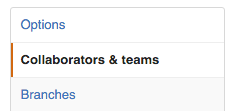
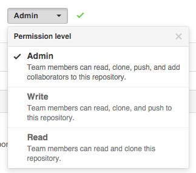

# GitHub
	
You might also have heard of [GitHub](https://github.com). GitHub is a company that hosts git repositories online and provides several collaboration features. GitHub fosters a great user community and has built a nice graphical interface to git, adding great visualization capacities of your data.

* **GitHub.com**: https://github.com
* **SNAPP on GitHub.com**: https://github.com/Science-for-Nature-and-People
* **NCEAS on GitHub.com**: https://github.com/nceas
* **NCEAS GitHub**: https://github.nceas.ucsb.edu/ ([you need to request access](https://help.nceas.ucsb.edu/git#getting_started_nceas_github_instance_using_rstudio))

## Forking

A **fork** is a **copy of a repository**. Forking a repository allows you to freely experiment with changes without affecting the original project.

Most commonly, forks are used to either propose changes to someone else's project or to use someone else's project as a starting point for your own idea.

When you are satisified with your work, you can intiate a ***Pull Request*** to initiate discussion about your modifications. Your commit hisotry allows the original repository administrators to see exactly what changes would be merged if they accept your request.  

By using GitHub's @mention system in your Pull Request message, you can ask for feedback from specific people or teams.

## NCEAS GitHub Instance

We are going to create a new repository on NCEAS GitHub instance. Note that is is a similar interface that you will have on gitHub.com.

URL: [https://github.nceas.ucsb.edu](https://github.nceas.ucsb.edu/)

LOGIN: the instance uses NCEAS LDAP authentication (same as redmine, …). 
If you do not have an NCEAS account you can create one [here](https://identity.nceas.ucsb.edu/identity/cgi-bin/ldapweb.cgi?cfg=account).

## Creating a new repo

* On NCEAS github website ([https://github.nceas.ucsb.edu](https://github.nceas.ucsb.edu/)):

    * Create a repo with the same name as your local repo/folder

        * Click on 

        * Choose the owner of your repo. We recommend to choose your institution as it is easier to manage user access through teams

        * Enter the descriptive name for your new repo

        * Check **"Initialize this repository with a README”** a descriptive readme file and choose the adequate

        * Add a .gitignore file (optional)

## Adding an existing local repo to your NCEAS instance

* On NCEAS github website ([https://github.nceas.ucsb.edu](https://github.nceas.ucsb.edu/)):

    * Same as "Creating a new repo", except

    * Do **not** create a readme file or .gitignore file

* On your local terminal:

    * Go inside your local repo with the terminal/shell

    * Add the remote: git remote add origin *URL to your repo*

    * Do the first push: git push -u origin master

    * Enter your NCEAS username and password

## Adding a team to a repository

* Click on the repository

* On the right panel, click 

* On the left pane, click Collaborators & teams 

* Select your team 

* Select the appropriate Permission level 

We recommend Admin or Write

# References
- GitHub:
 - guides on how to use GitHub: https://guides.github.com/
- Forking:
 - https://help.github.com/articles/fork-a-repo/ 
 - https://guides.github.com/activities/forking/

