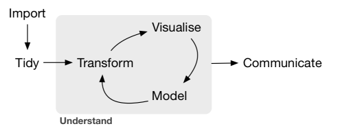
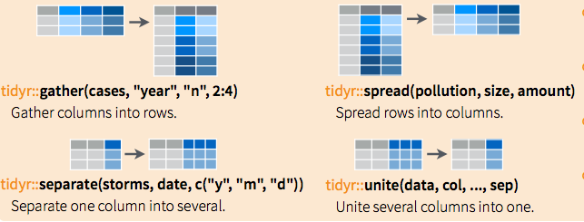

# Data wrangling

Data wrangling is the process of converting or mapping data from one "raw" form into another format that allows for more convenient analysis of the data with the help of semi-automated tools. In fact in our data era, a very large amount of time (80-90%) of the scientific worklow is dedicated to extract, clean, transform the raw data to allow the scientist to conduct its analaysis.

Data wrangling helps you to implement the data model you have conceptualize to empower you to do your analaysis. 


## Data wrangling in R

We are going to look into two R packages `tidyr` and `dplyr` that are meant to work together to help you to do data wrangling in R. But before we go intp greater details, it is woth mentioning these packages are meant to leverage the `magrittr` operators that aims to make your code more humans readable.



### magrittr 

**magrittr pipe operator `%>%` helps you to pipes the output of a previous operation as input to the following one**. 

 

The magrittr package, developped by Stefan Milton Bache, offers a set of operators which promote semantics that will improve your code by:

- structuring sequences of data operations left-to-right (as opposed to from the inside and out),
- avoiding nested function calls,
- minimizing the need for local variables and function definitions, and
- making it easy to add steps anywhere in the sequence of operations


### tidyr - strcuture your data

tidyr help you to structure your data in a "tidy" structure. For a dataset in the table format, the underlying data model is that ovbservations are rows and variables the columns. In other words, a dataset is messy or tidy depending on how rows, columns and tables are matched up with observations, variables and types. 

There are four fundamental functions of data tidying in tidyr:



- **`gather()`**: takes multiple columns, and gathers them into key-value pairs: it makes “wide” data longer
- **`spread()`**: takes two columns (key & value) and spreads in to multiple columns, it makes “long” data wider
- **`separate()`**: splits a single column into multiple columns
- **`unite()`**: combines multiple columns into a single column

#### => Open the Rscript: data/tidyr-dplyr/tidyr.R

### dplyr - transform your data

There are seven fundamental functions of data transformation in dplyr:

- **`select()`**: selecting variables
- **`filter()`**: provides basic filtering capabilities
- **`summarise()`** summarise data by functions of choice
- **`arrange()`** ordering data
- **`join()`** joining separate dataframes
- **`mutate()`** create new variables

Don't forget **`group by`**!! group_by() groups data by categorical levels and can be combine with other functions. We will talk more about this later.

[Data wrangling Cheatsheet](https://www.rstudio.com/wp-content/uploads/2015/02/data-wrangling-cheatsheet.pdf) 

#### => Open the Rscript: data/tidyr-dplyr/dplyr.R 


Use this script to investigate the popularity of your name!


## Challenge - House market

Zillow is a website providing information about houses for sale. It also collects a lot of data on real estate market. These data are available [here](http://www.zillow.com/research/data/). 

Our goal is to investigate at the zipcode level the difference between the median listed price (price that people ask for their house) and the median sale price (price that the house end up being sold for) from Jan 2010 to May 2016. 

```{r zillow example, eval = FALSE}
price_listing_median <- read_csv("Zip_MedianListingPrice_AllHomes.csv")
price_listing_median

Source: local data frame [10,390 x 83]

   RegionName          City State             Metro    CountyName SizeRank 2010-01 2010-02 2010-03 2010-04
        (chr)         (chr) (chr)             (chr)         (chr)    (int)   (dbl)   (dbl)   (dbl)   (dbl)
1       10025      New York    NY          New York      New York        1      NA      NA      NA      NA
2       60657       Chicago    IL           Chicago          Cook        2  349000  349000  339000  340000
3       60614       Chicago    IL           Chicago          Cook        3      NA      NA      NA      NA
4       79936       El Paso    TX           El Paso       El Paso        4  132000  129900  129900  129900
5       77084       Houston    TX           Houston        Harris        5  117500  117900  119900  120000
6       60640       Chicago    IL           Chicago          Cook        6      NA      NA      NA      NA
7       94109 San Francisco    CA     San Francisco San Francisco        7      NA      NA      NA      NA
8       75070      McKinney    TX Dallas-Fort Worth        Collin        8  189900  190000  189900  192950
9       11375      New York    NY          New York        Queens        9  329000  314950  287500  279888
10      77449       Cypress    TX           Houston        Harris       10  110890  111779  114900  115000
```


### By team of 2:

- Investigate the data and come up with a strategy on how to clean these messy csv. Inspire yourself from the tidyr script we just looked at.
- Create the pseudocode of the steps you need to do to be able to compute the difference listed price - sale price
- Implement your strategy on both csv. Might be slightly different steps.
- join and compute the difference listed price - sale price
- plot the time-series for the average median listed price for the county of Santa Barbara
- how does it compare to the national average?
- add the time-series for the average sale price for the county of Santa Barbara 

**!! Don't forget to use git to track your progress !!**

## References

- Data wrangling R cheatsheet: https://www.rstudio.com/wp-content/uploads/2015/02/data-wrangling-cheatsheet.pdf
- R for Data Science, H. Wickham: http://r4ds.had.co.nz/introduction.html
- R Programming for Data Science, Roger D. Peng: This book is for sale at http://leanpub.com/rprogramming
- Data Processing with dplyr & tidyr: https://rpubs.com/bradleyboehmke/data_wrangling
- RStudio webinar on Data wrangling: https://www.rstudio.com/resources/webinars/data-wrangling-with-r-and-rstudio/
- magrittr package: https://github.com/smbache/magrittr#----


